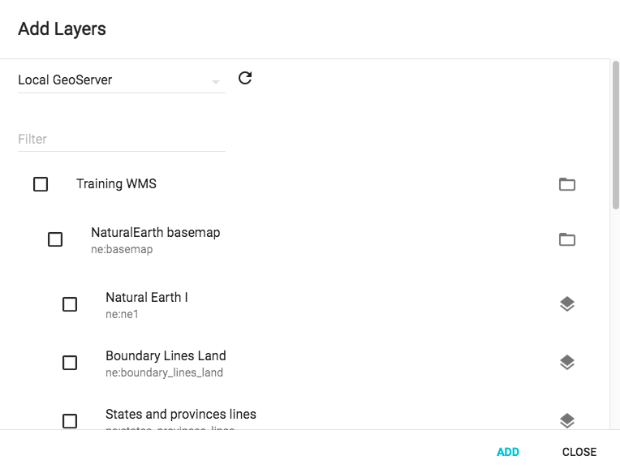

`AddLayerModal` (component)
===========================

Modal window to add layers from a WMS, WFS, WMTS or ArcGIS REST service.

```xml
<AddLayerModal map={map} allowUserInput={true} sources={[{url: '/geoserver/wms', type: 'WMS', title: 'Local GeoServer'}]} />
```



Properties
----------

### `allowUserInput`

Should be user be able to provide their own url?

type: `bool`
defaultValue: `false`


### `className`

Css class name to apply on the dialog.

type: `string`


### `map` (required)

The ol3 map to add layers to.

type: `instanceOf ol.Map`


### `sources`

List of sources to use for this dialog. Entries have a title, type and url property. Type can be one of: WMS, WFS, WMTS or ArcGISRest.

type: `arrayOf shape`

