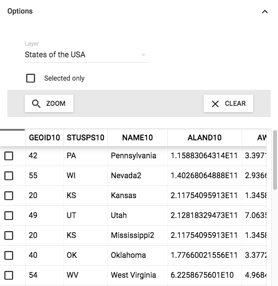

`FeatureTable` (component)
==========================

A table to show features. Allows for selection of features.

```javascript
var selectedLayer = map.getLayers().item(2);
```

```xml
<FeatureTable ref='table' layer={selectedLayer} map={map} />
```



Properties
----------

### `className`

Css class name to apply on the root element of this component.

type: `string`


### `height`

Optional fixed height in pixels.

type: `number`


### `layer`

The layer to use initially for loading the table.

type: `instanceOf ol.layer.Layer`


### `map` (required)

The ol3 map in which the source for the table resides.

type: `instanceOf ol.Map`


### `onUpdate`

Callback that gets called when the height needs updating of the parent container.

type: `func`


### `pageSize`

Number of features per page.

type: `number`
defaultValue: `20`


### `pointZoom`

The zoom level to zoom the map to in case of a point geometry.

type: `number`
defaultValue: `16`


### `refreshRate`

Refresh rate in ms that determines how often to resize the feature table when the window is resized.

type: `number`
defaultValue: `250`


### `sortable`

Should we allow for sorting the data?

type: `bool`
defaultValue: `true`

