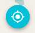
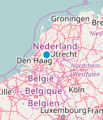

`Geolocation` (component)
=========================

Enable geolocation which uses the current position of the user in the map.
Can show the current position on the map, and also track the position.

```xml
<Geolocation map={map} />
```




Properties
----------

### `className`

Css class name to apply on the root element of this component.

type: `string`


### `map` (required)

The ol3 map for which to change its view's center.

type: `instanceOf ol.Map`


### `style`

Style for the button.

type: `object`

