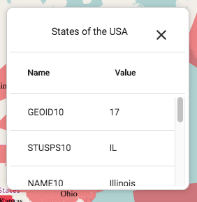

`InfoPopup` (component)
=======================

Popup to show feature info. This can be through WMS / WMTS GetFeatureInfo or local vector data.

```xml
<InfoPopup toggleGroup='navigation' map={map} />
```



Properties
----------

### `className`

Css class name to apply on the root element of this component.

type: `string`


### `hover`

Should we show feature info on hover instead of on click?

type: `bool`
defaultValue: `false`


### `infoFormat`

Format to use for WMS GetFeatureInfo requests.

type: `string`
defaultValue: `'text/plain'`


### `map` (required)

The ol3 map to register for singleClick.

type: `instanceOf ol.Map`

