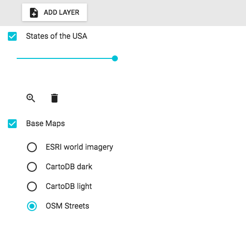

`LayerList` (component)
=======================

A list of layers in the map. Allows setting visibility and opacity.

```xml
<LayerList allowFiltering={true} showOpacity={true} showDownload={true} showGroupContent={true} showZoomTo={true} allowReordering={true} map={map} />
```



Properties
----------

### `addBaseMap`

Should we allow adding base maps from a selector modal?

type: `shape [object Object]`


### `addLayer`

Should we allow adding layers?

type: `shape [object Object]`


### `allowEditing`

Should we allow for editing of features in a vector layer?
This does require having a WFST component in your application.

type: `bool`
defaultValue: `false`


### `allowFiltering`

Should we allow for filtering of features in a layer?

type: `bool`
defaultValue: `false`


### `allowLabeling`

Should we allow for labeling of features in a layer?

type: `bool`
defaultValue: `false`


### `allowRemove`

Should we allow for removal of layers?

type: `bool`
defaultValue: `true`


### `allowReordering`

Should we allow for reordering of layers?

type: `bool`
defaultValue: `false`


### `allowStyling`

Should we allow for styling of features in a vector layer?

type: `bool`
defaultValue: `false`


### `className`

Css class name to apply on the root element of this component.

type: `string`


### `collapsible`

Should groups be collapsible?

type: `bool`
defaultValue: `true`


### `downloadFormat`

The feature format to serialize in for downloads.

type: `enum ('GeoJSON'|'KML'|'GPX')`
defaultValue: `'GeoJSON'`


### `filter`

A filter function to filter out some of the layers by returning false.

type: `func`


### `handleResolutionChange`

Should we handle resolution changes to show when a layer is in or out of scale?

type: `bool`
defaultValue: `true`


### `includeLegend`

Should we include the legend in the layer list?

type: `bool`
defaultValue: `false`


### `inlineDialogs`

Should dialogs show inline instead of a modal?

type: `bool`
defaultValue: `false`


### `labelStyleOutOfScale`

Style config for when label is out of scale.

type: `object`
defaultValue: `{
  color: '#BBBBBB'
}`


### `map` (required)

The map whose layers should show up in this layer list.

type: `instanceOf ol.Map`


### `showDownload`

Should we show a download button for layers?

type: `bool`
defaultValue: `false`


### `showGroupContent`

Should we show the contents of layer groups?

type: `bool`
defaultValue: `true`


### `showOnStart`

Should we show this component on start of the application?

type: `bool`
defaultValue: `false`


### `showOpacity`

Should we show an opacity slider for layers?

type: `bool`
defaultValue: `false`


### `showTable`

Should we show a button that can open up the feature table?

type: `bool`
defaultValue: `false`


### `showZoomTo`

Should we show a button that allows the user to zoom to the layer's extent?

type: `bool`
defaultValue: `false`


### `style`

Style for the button.

type: `object`


### `tipLabel`

Text to show on top of layers.

type: `string`


### `tooltipPosition`

Position of the tooltip.

type: `enum ('bottom'|'bottom-right'|'bottom-left'|'right'|'left'|'top-right'|'top'|'top-left')`

