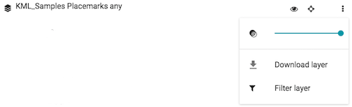

`LayerListItem` (component)
===========================

LayerListItem is the single component used to build out the larger LayerList component.  Each layer is represented as a LayerListItem


LayerListItem UI functions
-------------
SDK groups layers into one of three categories.  
* Base Layer
* Vector Layer
* Raster Layers


## Base Layers
Configured in the LayerList component definition
```var map = new ol.Map({
  layers: [
    new ol.layer.Group({
      type: 'base-group',
      title: 'Base Maps',
      layers: [
        new ol.layer.Tile({
          type: 'base',
          title: 'OSM Streets',
          source: new ol.source.OSM()
        }),
        new ol.layer.Tile({
          type: 'base',
          title: 'CartoDB light',
          visible: false,
          source: new ol.source.XYZ({
            url: 'http://s.basemaps.cartocdn.com/light_all/{z}/{x}/{y}.png',
            attributions: [
              new ol.Attribution({
                html: '&copy; <a href="http://www.openstreetmap.org/copyright">OpenStreetMap</a> contributors, &copy; <a href="http://cartodb.com/attributions">CartoDB</a>'
              })
            ]
          })
        }),
        new ol.layer.Tile({
          type: 'base',
          title: 'CartoDB dark',
          visible: false,
          source: new ol.source.XYZ({
            url: 'http://s.basemaps.cartocdn.com/dark_all/{z}/{x}/{y}.png',
            attributions: [
              new ol.Attribution({
                html: '&copy; <a href="http://www.openstreetmap.org/copyright">OpenStreetMap</a> contributors, &copy; <a href="http://cartodb.com/attributions">CartoDB</a>'
              })
            ]
          })
        }),
        new ol.layer.Tile({
          type: 'base',
          title: 'ESRI world imagery',
          visible: false,
          source: new ol.source.XYZ({
            attributions: [
              new ol.Attribution({
                html: 'Tiles &copy; Esri &mdash; Source: Esri, i-cubed, USDA, USGS, AEX, GeoEye, Getmapping, Aerogrid, IGN, IGP, UPR-EGP, and the GIS User Community'
              })
            ],
            url: 'http://server.arcgisonline.com/ArcGIS/rest/services/World_Imagery/MapServer/tile/{z}/{y}/{x}'
          })
        })
      ]
    })    ,
    new ol.layer.Vector({
      opacity: 1.0,
      source: new ol.source.Vector({
        format: new ol.format.KML(),
        url: './data/KML_Samples.kml'
      }),

      style: style_kml_samplesplacemarksany,
      selectedStyle: selectionStyle_kml_samplesplacemarksany,
      title: 'KML_Samples Placemarks any',
      id: 'KML_Samples_Placemarks_any20170227143106131',
      filters: [],
      timeInfo: null,
      isSelectable: true,
      popupInfo: ''
    })
  ],
  controls: [new ol.control.Attribution({collapsible: false}), new ol.control.ScaleLine()],
  view: new ol.View({
    center: [0, 0],
    zoom: 2
  })
});```

### `Download`

Download layer from Map, has no impact on services

Not available on base layers or Layers hosted from a server (WMS, WFS, ArcGISRest, WMTS)

Function can be disable with *showDownload* Prop



###  `Filter`

Opens the [FilterModal](FilterModal.html)

Option can be disable with *allowFiltering*


### `Opacity`

Changes the opacity of selected layer

Can not change opacity to a base layer

Option can be disable with *showOpacity* Prop


### `Remove`

Removed layer from Map, has no impact on services

Not available on base layers

Option can be disable with *allowRemove*


### `Style Editor`

Opens the [StyleModal](StyleModal.html)

Option can be disable with *allowStyling*


### `Visibility`

Turns Layer visibility on and off

Only one base layer can be on at once, all base layers can be turned off


### `Zoom to Layers`

Zooms to the bounds of selected layer

Can not zoom to a base layer

Option can be disable with *showZoomTo*


Properties
----------

### `allowEditing`

Should we allow editing of features in a vector layer?

type: `bool`


### `allowFiltering`

Should we allow for filtering of features in a layer?

type: `bool`


### `allowLabeling`

Should we allow for labeling of features in a layer?

type: `bool`


### `allowRemove`

Should we allow for removal of layers?

type: `bool`


### `allowReordering`

Should we show allow reordering?

type: `bool`


### `allowStyling`

Should we allow for styling of features in a vector layer?

type: `bool`


### `className`

Css class name to apply on the root element of this component.

type: `string`


### `collapsible`

Should groups be collapsible?

type: `bool`


### `downloadFormat`

The feature format to serialize in for downloads.

type: `enum ('GeoJSON'|'KML'|'GPX')`


### `group`

The group layer to which this item might belong.

type: `instanceOf ol.layer.Group`


### `handleResolutionChange`

Should we handle resolution changes to show when a layer is in or out of scale?

type: `bool`


### `includeLegend`

Should we include the legend in the layer list?

type: `bool`


### `inlineDialogs`

Should dialogs show inline instead of a modal?

type: `bool`


### `labelStyleOutOfScale`

Style config for when label is out of scale.

type: `object`


### `layer` (required)

The layer associated with this item.

type: `instanceOf ol.layer.Base`


### `map` (required)

The map in which the layer of this item resides.

type: `instanceOf ol.Map`


### `nestedItems`

The nested items to show for this item.

type: `array`


### `showDownload`

Should we show a download button?

type: `bool`


### `showOpacity`

Should we show an opacity slider for the layer?

type: `bool`


### `showTable`

Should we show a button that can open up the feature table?

type: `bool`


### `showZoomTo`

Should we show a zoom to button for the layer?

type: `bool`


### `title` (required)

The title to show for the layer.

type: `string`

