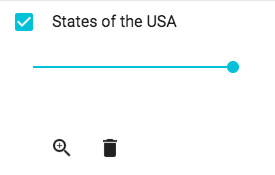

`LayerListItem` (component)
===========================

An item in the LayerList component.

Properties
----------

### `allowEditing`

Should we allow editing of features in a vector layer?

type: `bool`

### `allowFiltering`

Should we allow for filtering of features in a layer?

type: `bool`

### `allowLabeling`

Should we allow for labeling of features in a layer?

type: `bool`

### `allowRemove`

Should we allow for removal of layers?

type: `bool`

### `allowReordering`

Should we show allow reordering?

type: `bool`

### `allowStyling`

Should we allow for styling of features in a vector layer?

type: `bool`

### `className`

Css class name to apply on the root element of this component.

type: `string`

### `collapsible`

Should groups be collapsible?

type: `bool`

### `downloadFormat`

The feature format to serialize in for downloads.

type: `enum ('GeoJSON'|'KML'|'GPX')`

### `group`

The group layer to which this item might belong.

type: `instanceOf ol.layer.Group`

### `handleResolutionChange`

Should we handle resolution changes to show when a layer is in or out of scale?

type: `bool`

### `includeLegend`

Should we include the legend in the layer list?

type: `bool`

### `inlineDialogs`

Should dialogs show inline instead of a modal?

type: `bool`

### `labelStyleOutOfScale`

Style config for when label is out of scale.

type: `object`

### `layer` (required)

The layer associated with this item.

type: `instanceOf ol.layer.Base`

### `map` (required)

The map in which the layer of this item resides.

type: `instanceOf ol.Map`

### `nestedItems`

The nested items to show for this item.

type: `array`

### `showDownload`

Should we show a download button?

type: `bool`

### `showOpacity`

Should we show an opacity slider for the layer?

type: `bool`

### `showTable`

Should we show a button that can open up the feature table?

type: `bool`

### `showZoomTo`

Should we show a zoom to button for the layer?

type: `bool`

### `title` (required)

The title to show for the layer.

type: `string`

