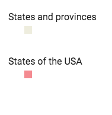

`Legend` (component)
====================

Legend component that can show legend graphic for WMS layers only currently.

```xml
<Legend map={map} />
```



Properties
----------

### `className`

Css class name to apply on the root element of this component.

type: `string`


### `map` (required)

The map whose layers should show up in this legend component.

type: `instanceOf ol.Map`


### `wmsOptions`

Options to send to the WMS legend. See WMSLegend component.

type: `object`

