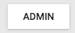
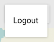

`Login` (component)
===================

Button that shows a login dialog for integration with GeoServer security.

```xml
<Login />
```





Properties
----------

### `className`

Css class name to apply on the root element of this component.

type: `string`


### `url`

Url to geoserver login endpoint.

type: `string`
defaultValue: `'/geoserver/app/api/login'`

