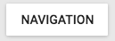
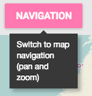

`Navigation` (component)
========================

Navigation button that allows to get the map back into navigation (zoom, pan, info popup) mode.

```xml
<Navigation secondary={true} toggleGroup='navigation' toolId='nav' />
```




Properties
----------

### `className`

Css class name to apply on the root element of this component.

type: `string`


### `secondary`

Should the button have the secondary state initially (pressed)?

type: `bool`


### `toggleGroup`

The toggleGroup to use. When this tool is activated, all other tools in the same toggleGroup will be deactivated.

type: `string`


### `toolId`

Identifier to use for this tool. Can be used to group tools together.

type: `string`

