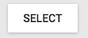

`Select` (component)
====================

The select tool allows users to select features in multiple layers at a time by drawing a rectangle.

```xml
<Select toggleGroup='navigation' map={map}/>
```



Properties
----------

### `className`

Css class name to apply on the root element of this component.

type: `string`


### `map` (required)

The map onto which to activate and deactivate the interactions.

type: `instanceOf ol.Map`


### `toggleGroup`

The toggleGroup to use. When this tool is activated, all other tools in the same toggleGroup will be deactivated.

type: `string`


### `toolId`

Identifier to use for this tool. Can be used to group tools together.

type: `string`

