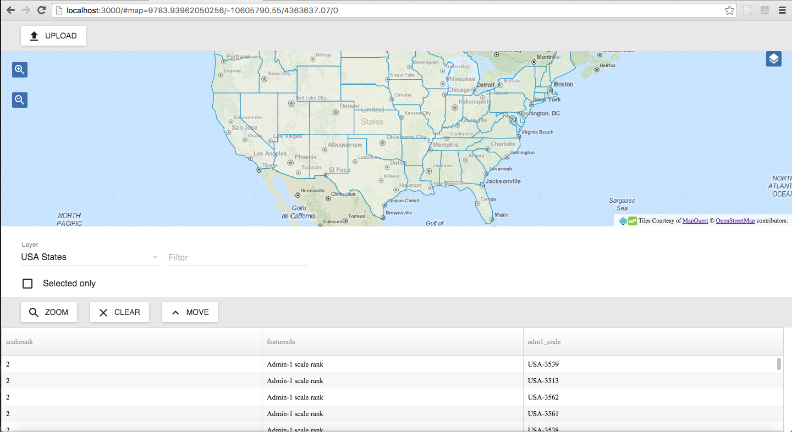

# Tutorial

## 1. Using the generator
In the getting started section we have learned how to create a skeleton application with the ```web-sdk``` command.

The skeleton application contains two base map layers, MapQuest streets and aerial, and a single widget, the ```LayerList``` widget.

The main file of the application is ```app.jsx```. Open up this file in your favorite text editor. Look for the definition of ```ol.Map```. The map gets defined with a layer group, that combines the MapQuest streets and aerial layers. The view is defined with an initial  center and zoom level. If you are not familiar with OpenLayers 3, the recommendation is to use the workshop at http://openlayers.org/workshop/ to get up to speed with OpenLayers 3.

## 2. Adding a vector layer from a GeoJSON file
Create a subdirectory called ```data``` in the root of the application directory, download USA states data as GeoJSON from: http://data.okfn.org/data/datasets/geo-boundaries-us-110m and save it to the ```data``` subdirectory.

```
mkdir data
curl "https://raw.githubusercontent.com/datasets/geo-boundaries-us-110m/master/json/ne_110m_admin_1_states_provinces_shp_scale_rank.geojson" -o data/ne_110m_admin_1_states_provinces_shp_scale_rank.geojson
```

Add the following layer definition in ```app.jsx``` after the existing ```ol.layer.Group```:

```javascript
  new ol.layer.Vector({
    id: 'states',
    title: 'USA States',
    source: new ol.source.Vector({
      url: 'data/ne_110m_admin_1_states_provinces_shp_scale_rank.geojson',
      format: new ol.format.GeoJSON()
    })
  })
```

And change the view's center so that the GeoJSON layer will be visible on start up:

```javascript
  view: new ol.View({
    center: [-10605790.55, 4363637.07],
    zoom: 4
  })
```

The full map definition should now look like:

```javascript
var map = new ol.Map({
  layers: [
    new ol.layer.Group({
      type: 'base-group',
      title: 'Base maps',
      layers: [
        new ol.layer.Tile({
          type: 'base',
          title: 'Streets',
          source: new ol.source.MapQuest({layer: 'osm'})
        }),
        new ol.layer.Tile({
          type: 'base',
          visible: false,
          title: 'Aerial',
          source: new ol.source.MapQuest({layer: 'sat'})
        })
      ]
    }),
    new ol.layer.Vector({
      id: 'states',
      title: 'USA States',
      source: new ol.source.Vector({
        url: 'data/ne_110m_admin_1_states_provinces_shp_scale_rank.geojson',
        format: new ol.format.GeoJSON()
      })
    })
  ],
  view: new ol.View({
    center: [-10605790.55, 4363637.07],
    zoom: 4
  })
});
```

## 3. Adding a feature grid
In this step we'll learn how to add another component to the application, besides the LayerList component which is already in the application. First, we'll add an import statement at the top of ```app.jsx```:

```javascript
import FeatureTable from './node_modules/boundless-sdk/js/components/FeatureTable.jsx';
```

In the render function of our application, we need to add the definition of our new component, FeatureTable:

The feature table needs to get configured with at least a layer and a map:

```html
  <div ref='map' id='map'></div>
  <div><LayerList map={map} /></div>
  <div id='table'><FeatureTable map={map} layer={map.getLayers().item(1)} /></div>
```

Our div with id ```table``` does not yet have a size, so open up ```app.css``` and give it some space on the page:

```css
#map {
  width: 100%;
  height: 60%;
}
#table {
  width: 100%;
  height: 40%;
}
```

We have reduced the map div to 60% height and allocated the other 40% for the table.

If you reload the debug server at http://localhost:3000/ you'll see that we now have a feature table at the bottom of the page. The width of the feature table however is not optimal. Let's define that we want our feature table to resize to the table div, for this we use the ```resizeTo``` property to point to the id of the table div:

```html
<FeatureTable resizeTo='table' map={map} layer={map.getLayers().item(1)} />
```

When you click a row in the feature table, it will select the corresponding geometry in the map.

Our app.jsx will now  look like:

```javascript
import React from 'react';
import ReactDOM from 'react-dom';
import ol from 'openlayers';
import {addLocaleData, IntlProvider} from 'react-intl';
import App from './node_modules/boundless-sdk/js/components/app.js';
import LayerList from './node_modules/boundless-sdk/js/components/LayerList.jsx';
import FeatureTable from './node_modules/boundless-sdk/js/components/FeatureTable.jsx';
import enLocaleData from './node_modules/react-intl/locale-data/en.js';
import enMessages from './node_modules/boundless-sdk/locale/en.js';

addLocaleData(
  enLocaleData
);

var map = new ol.Map({
  layers: [
    new ol.layer.Group({
      type: 'base-group',
      title: 'Base maps',
      layers: [
        new ol.layer.Tile({
          type: 'base',
          title: 'Streets',
          source: new ol.source.MapQuest({layer: 'osm'})
        }),
        new ol.layer.Tile({
          type: 'base',
          visible: false,
          title: 'Aerial',
          source: new ol.source.MapQuest({layer: 'sat'})
        })
      ]
    }),
    new ol.layer.Vector({
      id: 'states',
      title: 'USA States',
      source: new ol.source.Vector({
        url: 'data/ne_110m_admin_1_states_provinces_shp_scale_rank.geojson',
        format: new ol.format.GeoJSON()
      })
    })
  ],
  view: new ol.View({
    center: [-10605790.55, 4363637.07],
    zoom: 4
  })
});

class MyApp extends App {
  render() {
    return (
      <article>
        <div ref='map' id='map'></div>
        <div><LayerList map={map} /></div>
        <div id='table'><FeatureTable resizeTo='table' map={map} layer={map.getLayers().item(1)} /></div>
      </article>
    );
  }
}

ReactDOM.render(<IntlProvider locale='en' messages={enMessages}><MyApp map={map} /></IntlProvider>, document.getElementById('main'));
```

Our app.css will look like:

```css
html, body, article {
  width: 100%;
  height: 100%;
}
#main {
  width: 100%;
  height: 100%;
}
#map {
  width: 100%;
  height: 60%;
}
#table {
  width: 100%;
  height: 40%;
}
```

## 4. Adding an upload component
In this step we'll be adding a button to the application that will open up a dialog where the user can upload a vector file, such as a KML, GPX or GeoJSON file.

Again, we will start by adding an ```import``` statement to import our component:

```javascript
import AddLayer from './node_modules/boundless-sdk/js/components/AddLayer.jsx';
```

In the ```render``` function of our application, we need to add a toolbar to accommodate for the button of the upload component:

```html
  <nav role='navigation'>
    <div className='toolbar'>
      <ul><AddLayer map={map} /></ul>
    </div>
  </nav>
```

Add the ```nav``` just after the ```<article>``` opening tag.

Also add a div to group the map and featuretable divs, with id ```content```:

```html
  <div id='content'>
    <div ref='map' id='map'></div>
    <div><LayerList map={map} /></div>
    <div id='table'><FeatureTable resizeTo='table' map={map} layer={map.getLayers().item(1)} /></div>
  </div>
```

Open up app.css to give a bit of space to the button in the toolbar with ```padding-top```, also give the toolbar a fixed height and adjust the ```content``` div's height accordingly:

```css
.toolbar {
  height: 50px;
}
#content {
  width: 100%;
  height:  calc(100% - 50px);
}
.toolbar ul {
  padding-top: 4px;
}
```

The final app.jsx will look like:

```javascript
import React from 'react';
import ReactDOM from 'react-dom';
import ol from 'openlayers';
import {addLocaleData, IntlProvider} from 'react-intl';
import App from './node_modules/boundless-sdk/js/components/app.js';
import LayerList from './node_modules/boundless-sdk/js/components/LayerList.jsx';
import FeatureTable from './node_modules/boundless-sdk/js/components/FeatureTable.jsx';
import AddLayer from './node_modules/boundless-sdk/js/components/AddLayer.jsx';
import enLocaleData from './node_modules/react-intl/locale-data/en.js';
import enMessages from './node_modules/boundless-sdk/locale/en.js';

addLocaleData(
  enLocaleData
);

var map = new ol.Map({
  layers: [
    new ol.layer.Group({
      type: 'base-group',
      title: 'Base maps',
      layers: [
        new ol.layer.Tile({
          type: 'base',
          title: 'Streets',
          source: new ol.source.MapQuest({layer: 'osm'})
        }),
        new ol.layer.Tile({
          type: 'base',
          visible: false,
          title: 'Aerial',
          source: new ol.source.MapQuest({layer: 'sat'})
        })
      ]
    }),
    new ol.layer.Vector({
      id: 'states',
      title: 'USA States',
      source: new ol.source.Vector({
        url: 'data/ne_110m_admin_1_states_provinces_shp_scale_rank.geojson',
        format: new ol.format.GeoJSON()
      })
    })
  ],
  view: new ol.View({
    center: [-10605790.55, 4363637.07],
    zoom: 4
  })
});

class MyApp extends App {
  render() {
    return (
      <article>
        <nav role='navigation'>
          <div className='toolbar'>
            <ul><AddLayer map={map} /></ul>
          </div>
        </nav>
        <div id='content'>
          <div ref='map' id='map'></div>
          <div><LayerList map={map} /></div>
          <div id='table'><FeatureTable resizeTo='table' map={map} layer={map.getLayers().item(1)} /></div>
        </div>
      </article>
    );
  }
}

ReactDOM.render(<IntlProvider locale='en' messages={enMessages}><MyApp map={map} /></IntlProvider>, document.getElementById('main'));
```

The final app.css will look like:

```css
html, body, article {
  width: 100%;
  height: 100%;
}
#main {
  width: 100%;
  height: 100%;
}
#map {
  width: 100%;
  height: 60%;
}
#table {
  width: 100%;
  height: 40%;
}
.toolbar {
  height: 50px;
}
#content {
  width: 100%;
  height:  calc(100% - 50px);
}
.toolbar ul {
  padding-top: 4px;
}
```

The final application will look like: .
