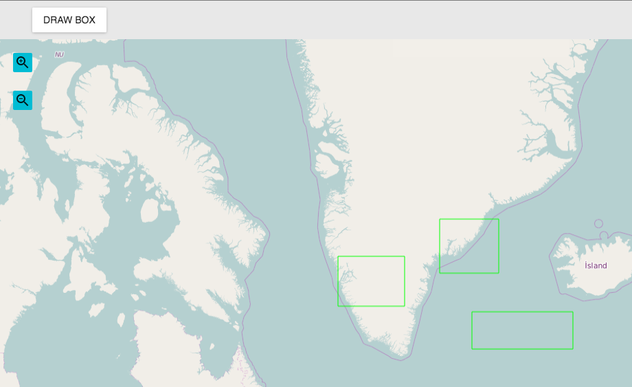

# Creating application components

## Introduction
This tutorial will show how to add additional functionality in the form of components to applications built using the Boundless SDK.

Three examples will be shown:

* Component that acts like a MapTool (DrawBox)
* Component that shows output (BoxInfo)
* Modify the DrawBox component so it shows a popup

These examples illustrate how to draw a box on a map and how to query that box (get its area).

Drawing boxes with a .

## Component that acts like a MapTool
The component will add a button called “Draw Box” to the toolbar which when clicked will allow the user to draw a rectangle on the map.

To begin, create a new application:

```
web-sdk ~/myapp
cd ~/myapp
nvm use --lts
npm i
npm start
```

Verify in the browser that the application is running successfully by navigating to http://localhost:3000/

## Add a toolbar
The first step is adding a toolbar so we have a container to put in our new MapTool. Open up app.jsx and add an import statement for the toolbar:

```javascript
import Toolbar from 'material-ui/Toolbar/Toolbar';
```

Add the Toolbar component to the render method:

```xml
  <div id='content'>
    <Toolbar />
    <MapPanel id='map' map={map} />
```

Open up app.css and change the .map selector to take into account the space that the toolbar takes up:

```css
#map {
  position: absolute;
  top: 56px;
  width: 100%;
  left: 0px;
  height: calc(100% - 56px);
}
```

Also move the zoom buttons and the layer list down:

```css
#zoom-buttons {
  margin-left: 20px;
  position: absolute;
  top: 76px;
}
div.layer-switcher {
  top: 76px;
}
```

We have now prepared the application for writing our own tool and adding it to the toolbar.

Create a new directory ```components``` and create a new file in it named ```DrawBox.js```. Copy and paste the following content:

```javascript
import React from 'react';
import ol from 'openlayers';
import ToolUtil from '@boundlessgeo/sdk/toolutil.js';
import RaisedButton from '@boundlessgeo/sdk/components/Button';

class DrawBox extends React.Component {
  constructor(props) {
    super(props);
    this._dispatchToken = ToolUtil.register(this);
    var source = new ol.source.Vector({wrapX: false});
    this._interaction = new ol.interaction.Draw({
      source: source,
      type: 'LineString',
      geometryFunction: function(coordinates, geometry) {
        if (!geometry) {
          geometry = new ol.geom.Polygon(null);
        }
        var start = coordinates[0];
        var end = coordinates[1];
        geometry.setCoordinates([
          [start, [start[0], end[1]], end, [end[0], start[1]], start]
        ]);
        return geometry;
      },
      maxPoints: 2
    });
    this._layer = new ol.layer.Vector({
      title: null, /* to keep it out of the LayerList */
      style: new ol.style.Style({
        stroke: new ol.style.Stroke({
          color: this.props.strokeColor
        })
      }),
      source: source,
      zIndex: 100000
    });
    this.props.map.addLayer(this._layer);
  }
  componentWillUnmount() {
    AppDispatcher.unregister(this._dispatchToken);
  }
  activate(interactions) {
    ToolUtil.activate(this, interactions);
  }
  deactivate() {
    ToolUtil.deactivate(this);
  }
  _drawBox() {
    this.activate(this._interaction);
  }
  render() {
    return (
      <RaisedButton {...this.props} label='Draw Box' tooltip='Click in the map and move the mouse to draw a box' onTouchTap={this._drawBox.bind(this)} />
    );
  }
}

DrawBox.propTypes = {
  strokeColor: React.PropTypes.string
};

DrawBox.defaultProps = {
  strokeColor: '#FF0000'
};

export default DrawBox;
```

Open up app.jsx and add an import for our new DrawBox component:

```javascript
import DrawBox from './components/DrawBox';
```

and add a DrawBox to the Toolbar:

```html
  <Toolbar>
    <DrawBox map={map} />
  </Toolbar>
```

Save the file and reload the browser. You will now see a button in the Toolbar that reads Draw Box. Let's examine the code in more detail.

Any MapTool kind of component (generally speaking tools / components that use OpenLayers interactions) will have the following:

```javascript
import ToolUtil from '@boundlessgeo/sdk/toolutil';

  constructor(props) {
    super(props);
    this._dispatchToken = ToolUtil.register(this);
    ...

  componentWillUnmount() {
    AppDispatcher.unregister(this._dispatchToken);
  }
  activate(interactions) {
    ToolUtil.activate(this, interactions);
  }
  deactivate() {
    ToolUtil.deactivate(this);
  }
```

In the constructor, we will register for all the events on the application dispatcher that are tool related. This means we will get deactivated automatically when another tool in the same toggleGroup gets activated. In the componentWillUnmount function we will unregister those listeners. Any map tool will have to have an activate and deactivate function. In our case, when the button is pressed, we will activate our instance of ````ol.interaction.Draw```. Optionally it can also have an enable and disable function to handle disabling itself in 3D (Globe) mode and enabling itself in 2D mode.

In our constructor we are creating a vector source to keep our boxes, and a draw interaction that can draw box geometries. Using a vector layer the boxes are displayed on the map, using a stroke color that can be configured by the end user and defaults to red.

Open up app.jsx and change our DrawBox to have a blue stroke color:

```html
<DrawBox strokeColor='#0000FF' map={map} />
```

## Component that shows output
In this exercise we will be creating a new component that will show the area of a box that is drawn by the DrawBox tool. In order to have 2 components communicate, we need to use the AppDispatcher. First, we need to prepare the HTML structure of the application for the box info panel. Open up app.jsx and wrap the existing content in a new div:

```html
  <div className='row container'>
    <Toolbar><DrawBox strokeColor='#0000FF' map={map} /></Toolbar>
    <MapPanel id='map' map={map} />
    <div><LayerList collapsible={false} map={map} /></div>
    <div id='zoom-buttons'><Zoom map={map} /></div>
  </div>
```

After this div, add a new row for our box info:

```
  <div className='row boxinfo'>
  </div>
```

Open up app.css and give some space to our boxinfo container:

```css
.container {
  height: 75%;
}
.boxinfo {
  position: absolute;
  top: 75%;
  width: 100%;
  height: 25%;
}
```

And change the height of the map to:

```css
height: calc(75% - 56px);
```

We have now prepared a container for our new component. Create a new file ```components/BoxInfo.js``` and open it up in your favorite text editor:

```javascript
import React from 'react';
import AppDispatcher from '@boundlessgeo/sdk/dispatchers/AppDispatcher';

class BoxInfo extends React.Component {
  constructor(props) {
    super(props);
    this.state = {
      boxInfo: []
    };
    var me = this;
    AppDispatcher.register((payload) => {
      let action = payload.action;
      switch (action.type) {
        case 'DRAWBOX':
          var geom = action.geometry;
          var start = 0;
          // only show 5 last entries
          if (me.state.boxInfo.length > 4) {
            start = me.state.boxInfo.length - 4;
          }
          var boxInfo = me.state.boxInfo.slice(start);
          boxInfo.push(this.props.tplText.replace('{area}', geom.getArea()));
          me.setState({boxInfo: boxInfo});
          break;
        default:
          break;
      }
    });

  }
  render() {
    var boxInfo = [];
    boxInfo.push(<p style={{margin: 0, backgroundColor: 'grey'}} key='header'>{this.props.title}</p>);
    for (var i = 0, ii = this.state.boxInfo.length; i < ii; ++i) {
      boxInfo.push(<span key={i}>{this.state.boxInfo[i]}<br/></span>);
    }
    return (<div>{boxInfo}</div>);
  }
}

BoxInfo.propTypes = {
  title: React.PropTypes.string,
  tplText: React.PropTypes.string
};


BoxInfo.defaultProps = {
  title: 'Box info',
  tplText: 'Area: {area}'
};

export default BoxInfo;
```

Later on we will examine this code in more detail, but for now just copy and paste this code. Open up app.jsx and add the BoxInfo component:

```javascript
import BoxInfo from './components/BoxInfo';

..
  <div className='row boxinfo'>
    <BoxInfo />
  </div>
```

Now when drawing a box we want to display the area in the box info tool, but nothing will happen as yet. This is because we are not firing DRAWBOX as yet through the AppDispatcher from the DrawBox tool. Open up DrawBox.js and make the following changes:

```javascript
import AppDispatcher from '@boundlessgeo/sdk/dispatchers/AppDispatcher';

  source.on('addfeature', function(evt) {
    AppDispatcher.handleAction({
      type: 'DRAWBOX',
      geometry: evt.feature.getGeometry()
    });
  }, this);
```

Add the ```addfeature``` listener in the constructor. Reload the browser and draw a box. After drawing the box, its area should get displayed. Now we will investigate the BoxInfo code in more detail. In the constructor we register a listener on the AppDispatcher for ```DRAWBOX```, the geometry will get sent in the payload. We will keep information from the last 5 drawn boxes, and it will get displayed by calling ```setState``` with the boxInfo array. The BoxInfo component can get configured with 2 properties:

* title, the title to display in the header of the panel
* tplText, the template text to display for each box

Now open up app.jsx and edit our BoxInfo definition:

```html
<BoxInfo title='Information about drawn boxes' tplText='Area of drawn box: {area}' />
```

and verify that these changes have effect.

## Modify the DrawBox component so it shows a popup
In this exercise we will be changing the DrawBox component so that it will also show an InfoPopup after drawing a box with its area. Open up ```components/DrawBox.js``` in your favorite text editor and make the following addition for the import:

```javascript
import ToolActions from '@boundlessgeo/sdk/actions/ToolActions';
```

Also modify the ```addfeature``` listener of the vector source:

```javascript
    source.on('addfeature', function(evt) {
      evt.feature.set('AREA', evt.feature.getGeometry().getArea());
      ToolActions.showPopup(evt.feature, this._layer);
      ..
```

This will set the AREA as an attribute on the feature and will call the showPopup function of ToolActions to display the popup for this feature. However our changes are not yet complete, we need to make 2 more changes. Open up ```components/DrawBox.js``` and change the definition of the layer:

```javascript
  popupInfo: '#AllAttributes',
```

This will indicate that all the feature's attributes need to get displayed in the popup, in our case this is only AREA. Now open up app.jsx:

```javascript
import InfoPopup from '@boundlessgeo/sdk/components/InfoPopup';
```

In the render function add the InfoPopup after the MapPanel:

```html
<div className='ol-popup'><InfoPopup toggleGroup='navigation' map={map} /></div>
```

And then change the DrawBox configuration so it is in the same toggleGroup:

```html
<DrawBox toggleGroup='navigation' strokeColor='#0000FF' map={map} />
```

Now reload the application and a draw a box. It should show a popup with its area as well.
